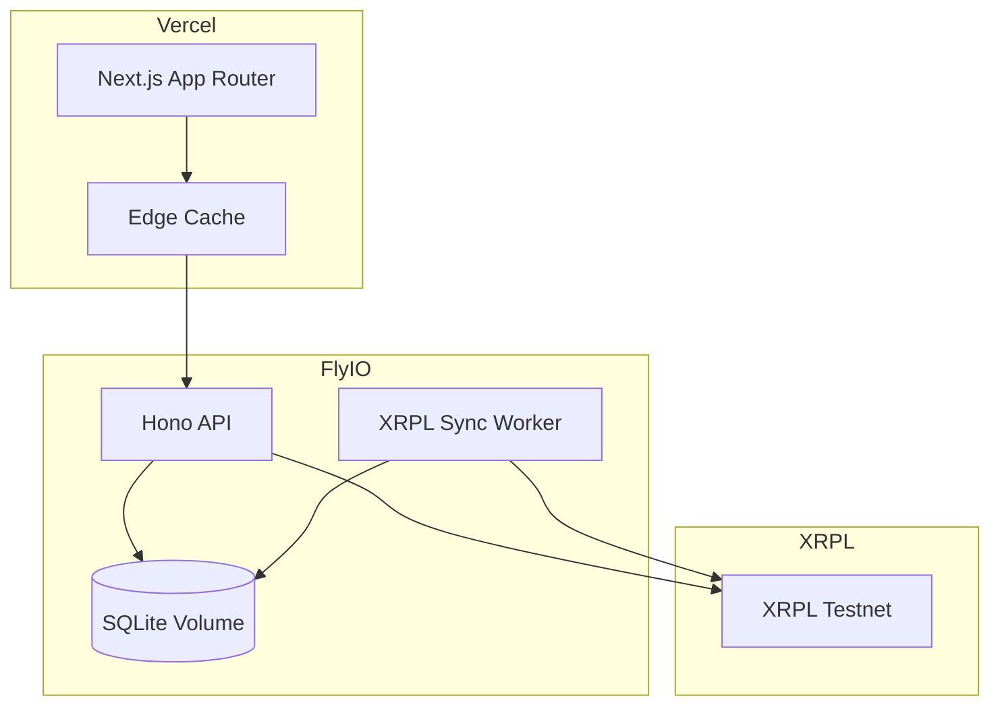
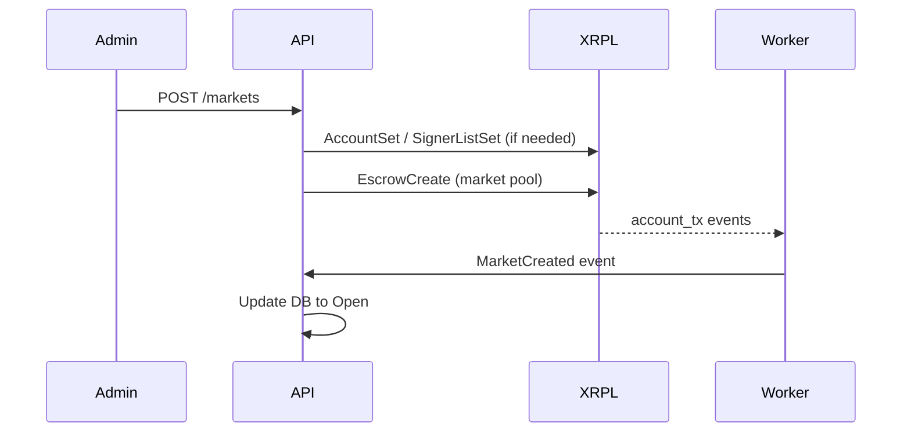
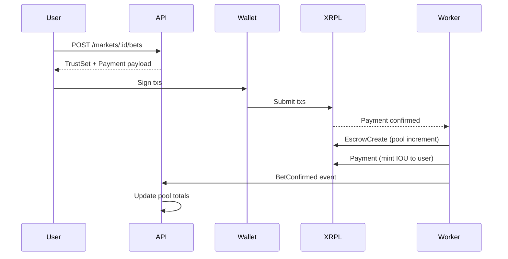
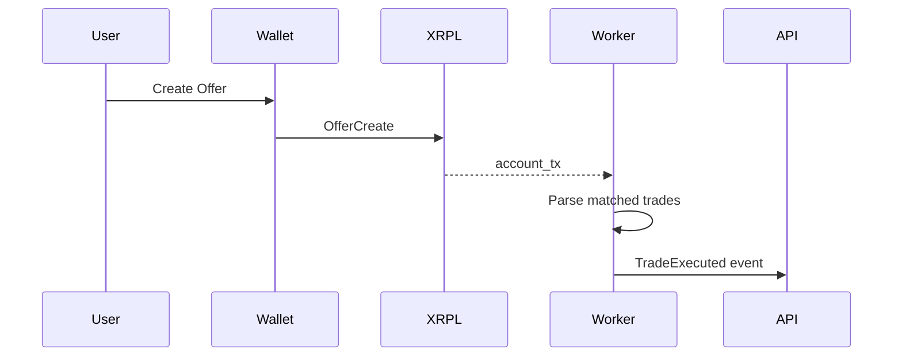
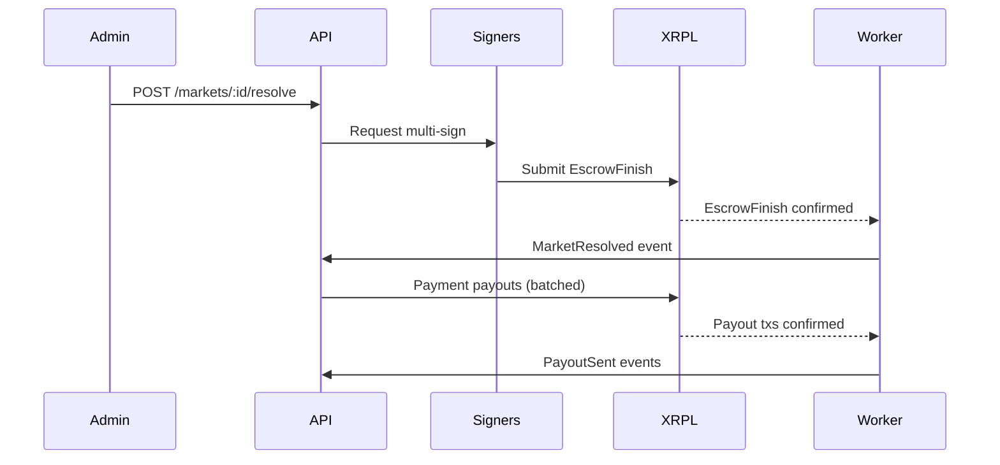
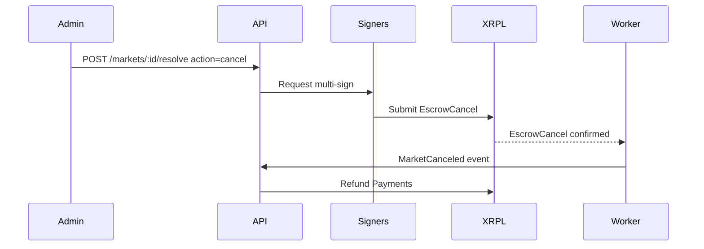

# Phase Brief: 5-frontend

**Generated:** 2026-02-11T21:44:19+09:00
**Status:** planned

## Project Context

**Name:** mitate

## Requirements

# MITATE — XRPL Parimutuel Prediction Market

## Overview

Prediction market DApp for the Japan Financial Infrastructure Innovation Program (JFIIP) hackathon. Demo Day: February 24, 2026.

## Problem Statement

Prediction markets provide valuable price signals for future events, but most implementations either:
- Require complex on-chain logic (AMM pricing) that doesn't fit XRPL's architecture
- Are generic implementations that could run on any chain (scoring disqualifier)

MITATE solves this by using XRPL-native primitives (Escrow, Issued Currency, DEX, Multi-Sign, Memo) to implement a parimutuel prediction market that deeply leverages XRPL's unique capabilities.

## Target Users

- Hackathon judges evaluating XRPL integration depth
- Users who want to bet on binary outcomes (YES/NO)
- Market creators who want to create prediction markets

## Scoring Alignment (Critical Context)

| Criteria | Weight | How MITATE Addresses It |
|---|---|---|
| XRPL Functions Used | 25% | 6 native features: Escrow, Issued Currency, Trust Line, DEX, Multi-Sign, Memo |
| Commercial Viability | 30% | Parimutuel is proven model (horse racing, sports betting) |
| Project Completeness | 25% | Working prototype with full bet→resolve→payout flow |
| Track Depth | 20% | Deep XRPL-native design, not portable to other chains |

## Core Features

### 1. Market Creation
- Create binary (YES/NO) prediction markets
- Set betting deadline (enforced via Escrow CancelAfter)
- Record market metadata in Memo fields
 - Create issuer-backed outcome tokens (Issued Currency) per market
 - Create market escrow(s) to hold XRP pool

#### XRPL Transaction Details (Market Creation)
**Account setup (one-time):**
- `AccountSet`
  - `Account`: `MARKET_OPERATOR_ADDRESS`
  - `SetFlag`: `asfDisableMaster` (optional, if using regular key)  
  - `SetFlag`: `asfDefaultRipple` (required for IOU transferability)
- `SignerListSet`
  - `Account`: `MARKET_OPERATOR_ADDRESS`
  - `SignerQuorum`: `2` (default; see Multi-Sign setup below)
  - `SignerEntries`: list of resolution signers and weights
- `AccountSet` (optional): set `RegularKey` for operational signing if desired

**Per-market:**
- `AccountSet` (issuer, optional): ensure `DefaultRipple` set for issuer if using separate issuer account
- `EscrowCreate` (one-time for market pool)
  - `Account`: `MARKET_OPERATOR_ADDRESS`
  - `Destination`: `MARKET_OPERATOR_ADDRESS` (self-escrow pool)
  - `Amount`: sum of all XRP bets for the market (escrows updated per bet; see flow)
  - `CancelAfter`: `betting_deadline_epoch`
  - `FinishAfter`: `resolution_time_epoch` (optional, if known)
  - `Condition`: omitted (if no crypto-condition is used)
  - `Memos`: market metadata (format below)
  - `DestinationTag`: market ID (optional but recommended)
  - `SourceTag`: market ID (optional but recommended)

**Issued Currency definition (per market, per outcome):**
- Token format:
  - `Currency`: 3-letter or 160-bit hex code  
    - If 3-letter: `YES` / `NO`  
    - If 160-bit: `YES` and `NO` prefixed with market ID, e.g. hex of `MITATE:<marketId>:YES`
  - `Issuer`: `MARKET_ISSUER_ADDRESS` (can be operator or dedicated issuer)
  - `Value`: numeric amount of outcome tokens (1 token = 1 XRP bet, or configurable ratio)

### 2. Betting Flow
- User places bet on YES or NO outcome
- XRP locked in Escrow (time-locked deposit)
- Outcome tokens (Issued Currency) minted to represent the bet
- Trust Line established for token holding

#### XRPL Transaction Details (Betting)
- `TrustSet`
  - `Account`: `USER_ADDRESS`
  - `LimitAmount`: `{ currency, issuer, value }` (set max outcome tokens user can hold)
  - `Memos`: `{ type: "bet", marketId, outcome }` (see Memo format)
- `Payment` (XRP bet amount from user to operator)
  - `Account`: `USER_ADDRESS`
  - `Destination`: `MARKET_OPERATOR_ADDRESS`
  - `Amount`: `bet_amount_drops`
  - `Memos`: `{ type: "bet", marketId, outcome }`
- `EscrowCreate` (operator locks funds per bet or aggregate)
  - `Account`: `MARKET_OPERATOR_ADDRESS`
  - `Destination`: `MARKET_OPERATOR_ADDRESS`
  - `Amount`: `bet_amount_drops` (or updated pool escrow)
  - `CancelAfter`: `betting_deadline_epoch`
  - `Memos`: `{ type: "escrow_pool", marketId }`
- `Payment` (mint outcome IOU to user from issuer)
  - `Account`: `MARKET_ISSUER_ADDRESS`
  - `Destination`: `USER_ADDRESS`
  - `Amount`: `{ currency, issuer, value: outcome_tokens }`
  - `Memos`: `{ type: "mint", marketId, outcome }`

### 3. Secondary Trading
- Outcome tokens tradable on XRPL DEX (OfferCreate)
- Peer-to-peer trading before market resolution

#### XRPL Transaction Details (Trading)
- `OfferCreate`
  - `Account`: `USER_ADDRESS`
  - `TakerGets`: `{ currency, issuer, value }` (outcome IOU to sell)
  - `TakerPays`: `XRP` or IOU (buy side asset)
  - `Expiration`: optional (set to betting deadline)
  - `Memos`: `{ type: "offer", marketId, outcome }`

**Note:** Offers should be blocked after betting deadline by UI and backend checks. Existing offers may still exist on-ledger; resolution flow must ignore any trades after deadline if they occur.

### 4. Resolution & Payout
- Multi-Sign governance for market resolution (prevents single-point manipulation)
- Parimutuel payout calculation: `totalPool × betAmount / Σ(betAmounts for winning outcome)`
- Payment transactions to winning token holders

#### XRPL Transaction Details (Resolution & Payout)
- `EscrowFinish` (release pooled XRP for payout)
  - `Account`: `MARKET_OPERATOR_ADDRESS` (multi-signed)
  - `Owner`: `MARKET_OPERATOR_ADDRESS`
  - `OfferSequence`: escrow sequence (per escrow)
  - `Memos`: `{ type: "resolve", marketId, outcome }`
  - `Condition` / `Fulfillment`: only if crypto-conditions used
- `EscrowCancel` (if market invalidated, refunds pool)
  - `Account`: `MARKET_OPERATOR_ADDRESS` (multi-signed)
  - `Owner`: `MARKET_OPERATOR_ADDRESS`
  - `OfferSequence`: escrow sequence
  - `Memos`: `{ type: "cancel", marketId }`
- `Payment` (payout to each winner)
  - `Account`: `MARKET_OPERATOR_ADDRESS`
  - `Destination`: `WINNER_ADDRESS`
  - `Amount`: `payout_drops`
  - `Memos`: `{ type: "payout", marketId, outcome }`
- `Payment` (burn outcome tokens by sending back to issuer)
  - `Account`: `USER_ADDRESS`
  - `Destination`: `MARKET_ISSUER_ADDRESS`
  - `Amount`: `{ currency, issuer, value }`
  - `Memos`: `{ type: "burn", marketId, outcome }`
  - **Note:** token burn can be required for payout eligibility or used for accounting only. Decide before implementation.

## Non-Goals (Hackathon Scope)

- Bet weighting (future feature, architecture supports it)
- Yield integration on locked funds (future feature)
- Stablecoin settlement (Escrow only supports XRP)
- Mobile app (web only)

## Technical Constraints

1. **XRPL Testnet only** — no mainnet deployment
2. **XRP-only settlement** — Escrow protocol limitation
3. **Off-chain payout calculation** — XRPL has no on-chain compute for ratio math
4. **Demo video max 3 minutes**
5. **Public GitHub repository required**

## Architecture Decisions (from ADR)

### Pricing: Parimutuel (not LMSR)
- XRPL has no on-chain compute for `b * ln(Σe^(q_i/b))`
- Parimutuel is simple ratio arithmetic, works with off-chain calculation
- All inputs publicly verifiable on-ledger

### Execution: XRPL L1 Native (not EVM Sidechain)
- Maximizes "XRPL Functions Used" score
- Demonstrates deep XRPL knowledge
- Not portable to other chains (differentiator)

### Settlement: XRP (not Stablecoin)
- Required for Escrow usage
- Testnet faucet availability
- Stablecoin support noted as future work

## On-chain vs Off-chain Responsibilities

### On-chain (XRPL L1)
| Function | XRPL Feature |
|---|---|
| Fund pool management | Escrow |
| Bet recording | Issued Currency (Trust Line) |
| Deadline enforcement | Escrow CancelAfter |
| Secondary trading | DEX (OfferCreate) |
| Resolution governance | Multi-Sign |
| Metadata recording | Memo |

### Off-chain (Server)
| Function | Description |
|---|---|
| Payout calculation | `totalPool × betAmount / Σ(betAmounts for winning outcome)` |
| Payout execution | Payment transactions to winners |
| Token holder queries | via `account_lines` API |
| Market management | Frontend + Backend |

## XRPL Integration Details (Expanded)

### Transaction Types & Required Fields
**Primary types used:**
- `EscrowCreate`, `EscrowFinish`, `EscrowCancel`
- `Payment` (XRP + IOU)
- `TrustSet`
- `OfferCreate` (DEX)
- `SignerListSet`, `AccountSet`
- `AccountInfo` / `AccountLines` for reads (RPC)

**Memos format (all txs):**
- `MemoType`: `MITATE` (hex-encoded ASCII)
- `MemoFormat`: `application/json` (hex-encoded ASCII)
- `MemoData`: JSON string (hex-encoded)
  - Base fields:
    - `v`: `1`
    - `type`: `market|bet|mint|offer|resolve|payout|cancel|escrow_pool`
    - `marketId`: string
    - `outcome`: `YES|NO` (if applicable)
    - `amount`: string numeric (if applicable)
    - `creator`: account (for market creation)
    - `timestamp`: ISO8601

**Issued Currency naming/structure:**
- `Currency` options:
  - 3-letter codes: `YES` / `NO` (simple, but ambiguous across markets)
  - 160-bit hex code: `MITATE:<marketId>:YES` / `MITATE:<marketId>:NO`
- **Recommendation:** use 160-bit hex code to avoid collisions and enable multiple markets simultaneously.
- `Issuer`: dedicated issuer account to isolate risk and simplify clawbacks if needed.

### Escrow Flow (Exact Fields)
**Create (per bet or per market pool):**
- `EscrowCreate`
  - `Account`: operator
  - `Destination`: operator (self-escrow) OR controlled escrow account
  - `Amount`: XRP in drops
  - `CancelAfter`: betting deadline (epoch)
  - `FinishAfter`: resolution time (epoch) if known; optional
  - `Memos`: `type=escrow_pool`, `marketId`
  - `DestinationTag`: `marketId` (optional)
  - `SourceTag`: `marketId` (optional)

**Finish (release to payouts):**
- `EscrowFinish`
  - `Account`: operator (multi-signed)
  - `Owner`: operator
  - `OfferSequence`: escrow sequence
  - `Condition` / `Fulfillment`: only if used
  - `Memos`: `type=resolve`, `marketId`, `outcome`

**Cancel (refund):**
- `EscrowCancel`
  - `Account`: operator (multi-signed)
  - `Owner`: operator
  - `OfferSequence`: escrow sequence
  - `Memos`: `type=cancel`, `marketId`

### Multi-Sign Setup (Resolution Governance)
**Recommended default (adjustable):**
- `SignerListSet`
  - `SignerQuorum`: `2`
  - `SignerEntries`: 3 signers with weight 1 each
- **Threshold:** 2-of-3 required for resolution transactions (`EscrowFinish`, `EscrowCancel`, and payout `Payment`).
- **Who signs:** operator + 2 neutral signers (e.g., hackathon mentors or judges).
- **Open Question:** whether to allow emergency single-signer cancel after `CancelAfter`.

## User Flows

### Flow: Create Market → Place Bet → Trade → Resolve → Claim
1. **Create market**
  - User submits market details (title, description, deadline, resolution criteria).
  - Backend creates market record in SQLite with `status=Draft`.
  - Backend submits XRPL txs:
    - Ensure issuer and operator account settings.
    - Create initial escrow (empty or 1 drop for linkage).
  - Market transitions to `Open` after success.
2. **Place bet**
  - User connects wallet and chooses outcome.
  - Frontend prepares `TrustSet` if no trust line.
  - User signs `Payment` of XRP bet to operator.
  - Backend observes tx, creates escrow entry, mints outcome token to user.
  - Market remains `Open` until deadline.
3. **Trade**
  - User creates `OfferCreate` to sell/buy YES/NO.
  - DEX matches offers; backend records trade events from ledger.
4. **Resolve**
  - After deadline, resolution committee signs `EscrowFinish` (or `EscrowCancel`).
  - Backend computes payout ratios off-chain and prepares payouts.
  - Market transitions to `Resolved`.
5. **Claim**
  - Winners claim by signing a `Payment` to burn outcome tokens (if required).
  - Backend sends XRP payout and records final `Paid` state.

### Wallet Connection Flow (Xaman/GemWallet/etc.)
1. User selects wallet provider.
2. Frontend detects provider and connects (e.g., `xumm` or `gemwallet` SDK).
3. User approves account access.
4. Frontend validates network = XRPL Testnet.
5. Store `userWallet` association in SQLite.

### Error States & Edge Cases
- **Bet after deadline:** reject client-side and server-side; do not mint tokens.
- **Escrow create failure:** refund user payment or queue retry; mark bet `Failed`.
- **Trust line missing or limit too low:** instruct user to set/raise trust line.
- **Offer remains after deadline:** ignore for payout calculations.
- **Resolution dispute:** require multi-sign threshold; if no quorum, market remains `Stalled`.
- **Issuer account lacks reserve:** cannot mint IOU; error and alert admin.
- **Wallet on wrong network:** show error and block actions.

## Data Model (Expanded)

### Persistence: SQLite vs On-Chain
**SQLite:**
- `markets` (metadata, deadlines, status, resolution outcome, escrow sequences)
- `bets` (user, amount, outcome, related tx hashes)
- `escrows` (sequence, status, amounts, cancel/finish hashes)
- `trades` (offer tx hash, matched trades)
- `users` (wallet address, provider, created_at)
- `payouts` (user, amount, status, tx hash)

**On-chain:**
- Escrows for pooled funds
- IOU balances for YES/NO holdings
- DEX offers and trades
- Memo metadata (market, bet, payout identifiers)

### Market States & Transitions
- `Draft` → `Open` (market created on-chain)
- `Open` → `Closed` (betting deadline reached)
- `Closed` → `Resolved` (outcome decided and escrow finished)
- `Resolved` → `Paid` (all payouts complete)
- `Open/Closed` → `Canceled` (escrow canceled/refunds)
- `Closed` → `Stalled` (no multi-sign quorum by resolution deadline)

### User/Wallet Associations
- Single user can link multiple wallet providers.
- `users` table keyed by wallet address; store provider type (`xaman`, `gemwallet`).
- Ensure uniqueness per wallet address; allow soft link to multiple login methods.

## API Contracts (Draft)

### Markets
- `GET /markets` → list markets
- `GET /markets/:id` → market details + on-chain status
- `POST /markets` → create market (admin)
- `PATCH /markets/:id` → update market metadata (admin only)
- `POST /markets/:id/close` → mark market closed (admin)

### Betting & Trading
- `POST /markets/:id/bets` → create bet intent (returns XRPL tx payload)
- `POST /markets/:id/bets/confirm` → confirm bet tx hash and mint tokens
- `POST /markets/:id/offers` → create offer intent (returns XRPL tx payload)

### Resolution & Payout
- `POST /markets/:id/resolve` → submit resolution outcome (multi-sig trigger)
- `POST /markets/:id/payouts` → execute payouts (admin)
- `GET /markets/:id/payouts` → list payouts

### Wallets
- `POST /wallet/connect` → associate wallet with user
- `GET /wallet/:address` → user profile and balances

### XRPL Webhooks / Subscriptions
- Subscribe to:
  - `account_tx` for operator and issuer accounts
  - `ledger` close events to detect deadline crossings
  - `account_lines` changes for token balances
- Webhook events:
  - `BetPaymentConfirmed`
  - `EscrowCreated`
  - `OfferMatched`
  - `ResolutionSigned`
  - `PayoutSent`

## Gaps / Questions (Open)
- Should bet escrow be per-bet or a single pooled escrow updated per bet?
- Should payout require token burn, or is holding token sufficient for payout eligibility?
- What is the exact resolution time vs betting deadline? Is there a fixed resolution window?
- Who are the multi-sign signers (names/addresses) for demo?
- Token naming: use 3-letter `YES/NO` or 160-bit hex code?
- Do we allow market creators other than the operator during demo?
- Should we support refunds if escrow create fails after bet payment?

## Technology Stack

| Layer | Technology |
|---|---|
| Frontend | Next.js (App Router), Vercel |
| Backend | Node.js / TypeScript (Hono), Fly.io |
| Database | SQLite (Fly.io Volume) |
| Blockchain | XRPL Testnet |
| XRPL SDK | xrpl.js |

## Existing Assets

- UI prototype exists at `app/` with:
  - Homepage, Markets listing, Market detail, Portfolio, Activity, Learn pages
  - shadcn/ui components
  - Mock data structure
- Need to update UI to reflect actual XRPL integration

## Success Criteria

1. **Working demo**: Full bet → resolve → payout flow on XRPL Testnet
2. **6 XRPL features**: Escrow, Issued Currency, Trust Line, DEX, Multi-Sign, Memo
3. **Verifiable**: All on-chain data independently checkable
4. **Documented**: Clear architecture, ADR, and README
5. **Deployable**: Live on Vercel + Fly.io for demo day

## Timeline

- Demo Day: February 24, 2026
- ~13 days from now

## Design Context

## api.md

# MITATE REST API

Base URL: `/api`

All requests and responses are JSON unless otherwise noted.

## Authentication
Two modes are supported.
- User auth via wallet signature.
- Admin auth via server-side API key.

### User auth flow
1. `POST /auth/nonce` returns a nonce string.
1. Client signs the nonce with wallet.
1. Client posts signature to `POST /auth/verify`.
1. Server returns a short-lived JWT for API access.

Nonce request
```http
POST /api/auth/nonce
```
Response
```json
{
  "nonce": "mitate:nonce:3e8a9f1a-..."
}
```

Verify request
```http
POST /api/auth/verify
```
Body
```json
{
  "walletAddress": "r...",
  "provider": "xaman",
  "signature": "..."
}
```
Response
```json
{
  "token": "<jwt>",
  "user": {
    "id": "usr_...",
    "walletAddress": "r...",
    "provider": "xaman"
  }
}
```

### Admin auth
- `X-Admin-Key` header required for admin endpoints.
- Admin endpoints are limited to market creation, resolution, and payouts.

## Error Model
```json
{
  "error": {
    "code": "MARKET_NOT_FOUND",
    "message": "Market not found",
    "details": {}
  }
}
```

Error codes
- `AUTH_REQUIRED`
- `INVALID_SIGNATURE`
- `INSUFFICIENT_SCOPE`
- `MARKET_NOT_FOUND`
- `MARKET_CLOSED`
- `BET_TOO_LATE`
- `INVALID_OUTCOME`
- `TRUSTLINE_REQUIRED`
- `XRPL_SUBMISSION_FAILED`
- `RATE_LIMITED`
- `VALIDATION_ERROR`

## Rate Limiting
- Default: 60 requests per minute per IP.
- Authenticated: 120 requests per minute per user.
- Admin: 30 requests per minute per key.
- Rate limit headers: `X-RateLimit-Limit`, `X-RateLimit-Remaining`, `X-RateLimit-Reset`.

## Endpoints

### Markets

#### GET /markets
List markets with summary and status.

Response
```json
{
  "data": [
    {
      "id": "mkt_...",
      "title": "Will BTC be above $70k on Feb 24?",
      "status": "Open",
      "bettingDeadline": "2026-02-20T00:00:00Z",
      "poolTotalDrops": "150000000",
      "yesTotalDrops": "90000000",
      "noTotalDrops": "60000000"
    }
  ]
}
```

#### GET /markets/:id
Market details with on-chain references.

Response
```json
{
  "data": {
    "id": "mkt_...",
    "title": "...",
    "description": "...",
    "status": "Open",
    "bettingDeadline": "2026-02-20T00:00:00Z",
    "resolutionTime": null,
    "issuerAddress": "r...",
    "operatorAddress": "r...",
    "xrplEscrowSequence": 12345,
    "poolTotalDrops": "150000000",
    "yesTotalDrops": "90000000",
    "noTotalDrops": "60000000"
  }
}
```

#### POST /markets
Create market. Admin only.

Request
```json
{
  "title": "...",
  "description": "...",
  "category": "crypto",
  "bettingDeadline": "2026-02-20T00:00:00Z",
  "resolutionTime": "2026-02-21T00:00:00Z"
}
```
Response
```json
{
  "data": {
    "id": "mkt_...",
    "status": "Draft"
  }
}
```

#### PATCH /markets/:id
Update metadata. Admin only.

#### POST /markets/:id/close
Admin only. Moves market to `Closed` when deadline passes.

### Betting

#### POST /markets/:id/bets
Create bet intent. Returns tx payloads.

Request
```json
{
  "outcome": "YES",
  "amountDrops": "1000000"
}
```
Response
```json
{
  "data": {
    "trustSet": {
      "TransactionType": "TrustSet",
      "Account": "rUser...",
      "LimitAmount": {
        "currency": "<hex>",
        "issuer": "rIssuer...",
        "value": "1000000"
      },
      "Memos": ["..."]
    },
    "payment": {
      "TransactionType": "Payment",
      "Account": "rUser...",
      "Destination": "rOperator...",
      "Amount": "1000000",
      "Memos": ["..."]
    }
  }
}
```

#### POST /markets/:id/bets/confirm
Confirm bet by tx hash. Mints tokens after verification.

Request
```json
{
  "paymentTx": "<hash>"
}
```
Response
```json
{
  "data": {
    "betId": "bet_...",
    "status": "Confirmed"
  }
}
```

### Trading

#### POST /markets/:id/offers
Create offer intent. Returns OfferCreate payload.

Request
```json
{
  "side": "sell",
  "outcome": "YES",
  "takerGets": "1000",
  "takerPaysDrops": "2000000"
}
```
Response
```json
{
  "data": {
    "offer": {
      "TransactionType": "OfferCreate",
      "Account": "rUser...",
      "TakerGets": {
        "currency": "<hex>",
        "issuer": "rIssuer...",
        "value": "1000"
      },
      "TakerPays": "2000000",
      "Memos": ["..."]
    }
  }
}
```

### Resolution and Payout

#### POST /markets/:id/resolve
Admin only. Initiates EscrowFinish or EscrowCancel.

Request
```json
{
  "outcome": "YES",
  "action": "finish" 
}
```
Response
```json
{
  "data": {
    "status": "Resolved",
    "escrowFinishTx": "<hash>"
  }
}
```

#### POST /markets/:id/payouts
Admin only. Executes payouts for winners.

Request
```json
{
  "batchSize": 50
}
```
Response
```json
{
  "data": {
    "payoutsCreated": 50,
    "status": "InProgress"
  }
}
```

#### GET /markets/:id/payouts
List payouts for a market.

### Wallets

#### POST /wallet/connect
Associates wallet with user.

Request
```json
{
  "walletAddress": "r...",
  "provider": "xaman"
}
```

#### GET /wallet/:address
Returns user profile and balances.

Response
```json
{
  "data": {
    "walletAddress": "r...",
    "markets": 3,
    "balances": [
      { "currency": "YES", "issuer": "r...", "value": "100" }
    ]
  }
}
```

## Webhooks and Realtime
- SSE endpoint: `GET /events` for live market updates.
- Events: `MarketUpdated`, `BetConfirmed`, `TradeExecuted`, `PayoutSent`.

## Validation and Security
- All inputs validated using Zod schemas in the API layer.
- Memo payloads are validated for `v`, `type`, and `marketId`.
- XRPL network must be Testnet; reject mainnet accounts.

---

## architecture.md

# MITATE System Architecture

## Overview
MITATE is a Next.js frontend on Vercel paired with a Hono API on Fly.io backed by SQLite. XRPL Testnet provides escrowed XRP, issued currency (YES/NO), DEX trading, multi-sign governance, and memo-based metadata. The backend is the source of truth for market state while continuously reconciling with on-chain data.

## Component Diagram
```mermaid
flowchart LR
  subgraph Client[Frontend - Next.js (Vercel)]
    UI[UI Pages + Components]
    Wallet[Wallet Connect (Xaman/GemWallet)]
    Realtime[Realtime Client (SSE/WebSocket)]
  end

  subgraph Backend[Backend - Hono API (Fly.io)]
    API[REST API]
    Worker[XRPL Sync Worker]
    Calc[Payout Calculator]
    DB[(SQLite on Fly Volume)]
  end

  subgraph XRPL[XRPL Testnet]
    Ledger[XRPL Ledger]
    WS[WebSocket Server]
    RPC[JSON-RPC / HTTP]
  end

  UI --> API
  Wallet --> XRPL
  Realtime --> API

  API --> DB
  Worker --> DB
  Calc --> DB

  API --> RPC
  Worker --> WS
  Worker --> RPC

  WS --> Worker
  RPC --> API
  Ledger --> WS
```

## Data Flow
1. Market creation
1. Frontend sends `POST /markets` with market metadata.
1. Backend writes a `markets` row with `status=Draft`.
1. Backend submits XRPL txs (AccountSet, SignerListSet if needed, EscrowCreate, memoed metadata).
1. Worker confirms ledger txs, updates market to `Open`, stores escrow sequence and tx hashes.

2. Betting
1. Frontend requests bet intent `POST /markets/:id/bets`.
1. Backend returns XRPL tx payload for user `Payment` and optional `TrustSet`.
1. User signs via wallet and submits to XRPL.
1. Worker sees `Payment` memo, creates `bets` row, creates escrow pool increment, and mints IOUs via issuer `Payment`.
1. Backend updates market totals and exposes live pool via realtime channel.

3. Secondary trading
1. User creates DEX `OfferCreate` using wallet.
1. Worker listens to `account_tx` for issuer/operator and `ledger` events, and records matched trades.
1. Frontend shows IOU price and order activity.

4. Resolution and payout
1. Admin resolves market via `POST /markets/:id/resolve`.
1. Backend creates multi-signed `EscrowFinish` (or `EscrowCancel`) and queues payout plan.
1. Once escrow finishes, backend executes payouts (batched `Payment`s).
1. Worker reconciles payouts, marks `payouts` as complete.

## Deployment Architecture


Operational notes
- Vercel hosts the Next.js frontend and static assets.
- Fly.io hosts the Hono API and XRPL sync worker in the same app or separate process groups.
- SQLite runs on a Fly volume with WAL mode enabled for concurrency.
- Environment variables provide XRPL endpoints, issuer/operator accounts, and signer settings.

## XRPL Integration Layer Design

### Backend Services
- `xrpl-client` module
  - Maintains HTTP JSON-RPC and WebSocket connections.
  - Normalizes tx results into internal events.
- `tx-builder` module
  - Builds XRPL transactions with memo encoding and validation.
  - Supports AccountSet, SignerListSet, TrustSet, Payment, EscrowCreate/Finish/Cancel, OfferCreate.
- `tx-signer` module
  - Supports multi-sign and single-sign flows.
  - Generates canonical tx blobs for wallet signing and server signing.
- `ledger-sync` module
  - Subscribes to `account_tx` for operator and issuer.
  - Subscribes to `ledger` close events.
  - Backfills on startup from last validated ledger index stored in DB.

### Event Types
- `MarketCreated`, `MarketOpened`
- `BetPaid`, `EscrowCreated`, `TokensMinted`
- `OfferCreated`, `OfferMatched`
- `MarketResolved`, `PayoutSent`, `MarketCanceled`

### Idempotency
- All XRPL events map to deterministic DB updates.
- Unique constraints on tx hash and offer sequence prevent double-apply.
- Ledger sync stores `last_ledger_index` in `system_state` for safe resume.

### Memo Encoding
- All txs include MemoType `MITATE` and MemoFormat `application/json`.
- MemoData JSON includes `v`, `type`, `marketId`, `outcome`, `amount`, and `timestamp`.

## Assumptions and Open Questions
- Pool escrow design uses a single pooled escrow per market; per-bet escrow is optional but not used by default.
- Payout requires token burn only if the demo chooses to enforce it; otherwise token burn is for accounting.
- Resolution uses 2-of-3 multi-sign as default and is adjustable via config.

---

## data-model.md

# MITATE Data Model (SQLite)

## Overview
SQLite is the system of record for market lifecycle, XRPL transaction mapping, and payouts. The database is append-friendly and reconciles with XRPL ledger events.

## Tables

### users
```sql
CREATE TABLE users (
  id TEXT PRIMARY KEY,
  wallet_address TEXT NOT NULL UNIQUE,
  provider TEXT NOT NULL, -- xaman|gemwallet|manual
  created_at TEXT NOT NULL DEFAULT (strftime('%Y-%m-%dT%H:%M:%fZ','now')),
  updated_at TEXT NOT NULL DEFAULT (strftime('%Y-%m-%dT%H:%M:%fZ','now'))
);
```

### markets
```sql
CREATE TABLE markets (
  id TEXT PRIMARY KEY,
  title TEXT NOT NULL,
  description TEXT NOT NULL,
  category TEXT,
  status TEXT NOT NULL, -- Draft|Open|Closed|Resolved|Paid|Canceled|Stalled
  outcome TEXT, -- YES|NO when resolved
  created_by TEXT NOT NULL,
  betting_deadline TEXT NOT NULL,
  resolution_time TEXT,
  created_at TEXT NOT NULL DEFAULT (strftime('%Y-%m-%dT%H:%M:%fZ','now')),
  updated_at TEXT NOT NULL DEFAULT (strftime('%Y-%m-%dT%H:%M:%fZ','now')),
  xrpl_market_tx TEXT, -- tx hash for market creation
  xrpl_escrow_sequence INTEGER,
  xrpl_escrow_tx TEXT,
  xrpl_escrow_finish_tx TEXT,
  xrpl_escrow_cancel_tx TEXT,
  pool_total_drops TEXT NOT NULL DEFAULT '0',
  yes_total_drops TEXT NOT NULL DEFAULT '0',
  no_total_drops TEXT NOT NULL DEFAULT '0',
  issuer_address TEXT NOT NULL,
  operator_address TEXT NOT NULL
);
```

### bets
```sql
CREATE TABLE bets (
  id TEXT PRIMARY KEY,
  market_id TEXT NOT NULL,
  user_id TEXT NOT NULL,
  outcome TEXT NOT NULL, -- YES|NO
  amount_drops TEXT NOT NULL,
  status TEXT NOT NULL, -- Pending|Confirmed|Failed|Refunded
  placed_at TEXT NOT NULL DEFAULT (strftime('%Y-%m-%dT%H:%M:%fZ','now')),
  payment_tx TEXT, -- user Payment tx hash
  escrow_tx TEXT, -- escrow creation tx hash
  mint_tx TEXT, -- issuer Payment tx hash
  memo_json TEXT,
  FOREIGN KEY (market_id) REFERENCES markets(id),
  FOREIGN KEY (user_id) REFERENCES users(id)
);
```

### escrows
```sql
CREATE TABLE escrows (
  id TEXT PRIMARY KEY,
  market_id TEXT NOT NULL,
  amount_drops TEXT NOT NULL,
  status TEXT NOT NULL, -- Open|Finished|Canceled
  sequence INTEGER NOT NULL,
  create_tx TEXT NOT NULL,
  finish_tx TEXT,
  cancel_tx TEXT,
  cancel_after INTEGER NOT NULL,
  finish_after INTEGER,
  created_at TEXT NOT NULL DEFAULT (strftime('%Y-%m-%dT%H:%M:%fZ','now')),
  updated_at TEXT NOT NULL DEFAULT (strftime('%Y-%m-%dT%H:%M:%fZ','now')),
  FOREIGN KEY (market_id) REFERENCES markets(id)
);
```

### trades
```sql
CREATE TABLE trades (
  id TEXT PRIMARY KEY,
  market_id TEXT NOT NULL,
  offer_tx TEXT NOT NULL,
  taker_gets TEXT NOT NULL,
  taker_pays TEXT NOT NULL,
  executed_at TEXT NOT NULL,
  ledger_index INTEGER NOT NULL,
  memo_json TEXT,
  FOREIGN KEY (market_id) REFERENCES markets(id)
);
```

### payouts
```sql
CREATE TABLE payouts (
  id TEXT PRIMARY KEY,
  market_id TEXT NOT NULL,
  user_id TEXT NOT NULL,
  amount_drops TEXT NOT NULL,
  status TEXT NOT NULL, -- Pending|Sent|Failed
  payout_tx TEXT,
  created_at TEXT NOT NULL DEFAULT (strftime('%Y-%m-%dT%H:%M:%fZ','now')),
  updated_at TEXT NOT NULL DEFAULT (strftime('%Y-%m-%dT%H:%M:%fZ','now')),
  FOREIGN KEY (market_id) REFERENCES markets(id),
  FOREIGN KEY (user_id) REFERENCES users(id)
);
```

### wallet_links
```sql
CREATE TABLE wallet_links (
  id TEXT PRIMARY KEY,
  user_id TEXT NOT NULL,
  wallet_address TEXT NOT NULL,
  provider TEXT NOT NULL,
  created_at TEXT NOT NULL DEFAULT (strftime('%Y-%m-%dT%H:%M:%fZ','now')),
  UNIQUE (wallet_address, provider),
  FOREIGN KEY (user_id) REFERENCES users(id)
);
```

### ledger_events
```sql
CREATE TABLE ledger_events (
  id TEXT PRIMARY KEY,
  tx_hash TEXT NOT NULL UNIQUE,
  event_type TEXT NOT NULL,
  market_id TEXT,
  payload_json TEXT NOT NULL,
  ledger_index INTEGER NOT NULL,
  created_at TEXT NOT NULL DEFAULT (strftime('%Y-%m-%dT%H:%M:%fZ','now'))
);
```

### system_state
```sql
CREATE TABLE system_state (
  key TEXT PRIMARY KEY,
  value TEXT NOT NULL,
  updated_at TEXT NOT NULL DEFAULT (strftime('%Y-%m-%dT%H:%M:%fZ','now'))
);
```

## Indexes
```sql
CREATE INDEX idx_markets_status ON markets(status);
CREATE INDEX idx_markets_deadline ON markets(betting_deadline);
CREATE INDEX idx_bets_market ON bets(market_id);
CREATE INDEX idx_bets_user ON bets(user_id);
CREATE INDEX idx_bets_status ON bets(status);
CREATE INDEX idx_escrows_market ON escrows(market_id);
CREATE INDEX idx_trades_market ON trades(market_id);
CREATE INDEX idx_payouts_market ON payouts(market_id);
CREATE INDEX idx_payouts_user ON payouts(user_id);
CREATE INDEX idx_ledger_events_market ON ledger_events(market_id);
CREATE INDEX idx_ledger_events_ledger ON ledger_events(ledger_index);
```

## Relationships and Constraints
- `markets` to `bets`, `escrows`, `trades`, and `payouts` are one-to-many.
- `users` to `bets` and `payouts` are one-to-many.
- `wallet_links` allows multiple providers per user.
- `ledger_events.tx_hash` is unique for idempotent ingestion.
- `escrows.sequence` is unique per market via application logic.

## Migration Strategy
- Use a lightweight migration table with ordered SQL files.
- Run migrations on API startup and worker startup with a DB lock to avoid race conditions.
- Keep migrations idempotent with `IF NOT EXISTS` for tables and indexes.

Migration table
```sql
CREATE TABLE IF NOT EXISTS migrations (
  id INTEGER PRIMARY KEY AUTOINCREMENT,
  name TEXT NOT NULL UNIQUE,
  applied_at TEXT NOT NULL DEFAULT (strftime('%Y-%m-%dT%H:%M:%fZ','now'))
);
```

Migration flow
1. Load migration files in lexical order.
1. For each file, check `migrations.name`.
1. Apply in a transaction.
1. Insert a record on success.

## WAL and Concurrency
- Enable WAL mode for better concurrent reads.
- Set a busy timeout for write contention.

```sql
PRAGMA journal_mode = WAL;
PRAGMA busy_timeout = 5000;
```

---

## ui-components.md

# MITATE UI Components

## Key Components and State

### MarketCard
State
- `marketId`
- `title`, `status`, `bettingDeadline`
- `poolTotal`, `yesTotal`, `noTotal`
- `priceYes`, `priceNo` (derived from pool totals)

### MarketDetailHeader
State
- `marketId`, `title`, `status`
- `countdown` to betting deadline
- `poolTotal`, `oddsYes`, `oddsNo`

### OutcomeSelector
State
- `selectedOutcome`
- `amountDrops`
- `validationErrors`

### BetForm
State
- `walletConnected`
- `trustlineNeeded`
- `txPayloads`
- `submitStatus`

### TradeForm
State
- `side`, `outcome`, `amountIOU`, `priceDrops`
- `offerPayload`

### PortfolioPanel
State
- `balances` from `account_lines`
- `openBets`, `resolvedBets`
- `pendingPayouts`

### MarketTimeline
State
- `marketStatus`
- `ledgerEvents` list

### AdminResolvePanel
State
- `outcome`, `action`
- `multiSignStatus`
- `payoutBatchProgress`

## Wallet Connection Flow
1. User clicks `Connect Wallet`.
1. App lists providers: Xaman and GemWallet.
1. Provider SDK initializes and requests account access.
1. App verifies `network` is Testnet.
1. App stores wallet address in local state and requests JWT via `/auth/nonce` + `/auth/verify`.
1. App caches JWT in memory and refreshes when needed.

## Real-Time Updates Strategy
- Use SSE at `GET /events` for minimal client overhead.
- Event payloads drive optimistic UI updates.
- Fallback to polling every 20 seconds if SSE disconnected.
- Client updates: pool totals, status changes, and payout confirmations.

## Existing UI Pages to Update

### `app/page.tsx` (Homepage)
- Add live market highlights and current pool totals.
- Add CTA for creating a market if admin.

### `app/markets/page.tsx` (Markets listing)
- Replace mock data with `GET /markets`.
- Include status badges and deadlines.

### `app/markets/[id]/page.tsx` (Market detail)
- Integrate `MarketDetailHeader`, `OutcomeSelector`, `BetForm`.
- Show real-time pool totals and DEX-derived prices.

### `app/portfolio/page.tsx` (Portfolio)
- Show IOU balances and pending payouts.
- Add claim status and history.

### `app/activity/page.tsx` (Activity)
- Show ledger event history and payout events.

### `app/learn/page.tsx` (Learn)
- Update copy to explain parimutuel mechanics and XRPL features used.

## UI State Management
- Use React context for `WalletContext` and `MarketContext`.
- Use `SWR` or `react-query` for data fetching and cache invalidation.
- Keep XRPL tx payloads in component state only.

## Form Validation
- Amounts are integers in drops for XRP.
- Enforce minimum bet size (config).
- Prevent betting after deadline on client and server.

## Error and Empty States
- No markets: show call-to-action to create one.
- Wallet not connected: show connect banner on betting and trading components.
- Trustline missing: show one-click setup with `TrustSet` payload.

---

## xrpl-integration.md

# XRPL Integration Design

## Overview
MITATE uses XRPL Testnet with Escrow, Issued Currency, Trust Lines, DEX Offers, Multi-Sign, and Memo metadata. All market-critical data can be independently verified on-ledger.

## Transaction Building Helpers
`tx-builder` module exposes typed helpers to build and validate XRPL transactions. All helpers attach Memo metadata and enforce Testnet-only settings.

Example helper signature
```ts
export function buildBetPayment(params: {
  account: string
  destination: string
  amountDrops: string
  marketId: string
  outcome: "YES" | "NO"
  memoTimestamp: string
}): Payment
```

Memo encoding
```ts
export function encodeMemo(data: Record<string, unknown>) {
  return {
    Memo: {
      MemoType: toHex("MITATE"),
      MemoFormat: toHex("application/json"),
      MemoData: toHex(JSON.stringify(data))
    }
  }
}
```

## WebSocket Subscription Strategy
- Subscribe to `account_tx` for operator and issuer accounts.
- Subscribe to `ledger` for deadline crossings and backfill triggers.
- On startup, fetch `account_tx` from last stored ledger index to current validated.
- Maintain a `last_ledger_index` in `system_state` to resume safely.

## Sequence Diagrams

### Market Creation


### Place Bet


### Secondary Trading


### Resolution and Payout


### Cancel Market


## Error Recovery and Retry Logic

### Submission failures
- On `tem` or `tel` errors, retry with exponential backoff up to 3 times.
- On `tef` or `tec` errors, mark tx as failed and open an admin alert.

### Escrow create or mint failure
- If `Payment` from user succeeds but mint fails, create a `bets` row with `status=Failed` and queue refund.
- If escrow create fails, do not mint tokens. Queue refund.

### WebSocket disconnect
- Reconnect with backoff.
- On reconnect, backfill from `last_ledger_index` to avoid missing events.

### Idempotent writes
- Store `tx_hash` and `ledger_index` in `ledger_events`.
- Use `INSERT OR IGNORE` for duplicate events.

## XRP and IOU Helpers
- `amountDrops` uses string integer drops.
- IOU amounts use string decimal.
- Convert XRP <-> drops using fixed 1 XRP = 1,000,000 drops.

## Payout Calculation
- `payout = totalPool * userBet / totalWinningBets`.
- Compute in integer drops with floor rounding.
- Store rounding remainder in a `market_remainder_drops` field and distribute to largest bettors if needed.

## Phase Overview

# Phase Overview

## Phases (In Order)
1. Foundation & Setup
2. XRPL Core Integration
3. Market Lifecycle
4. Trading & Resolution
5. Frontend Integration
6. Polish & Demo Prep

## Dependencies
- 1 -> 2: monorepo + backend scaffold + XRPL client + DB schema are prerequisites for core XRPL tx builders and ingestion.
- 2 -> 3: transaction builders, memo codec, and ledger ingestion required before market lifecycle flows.
- 3 -> 4: market creation/betting flows must exist before DEX trading and resolution/payouts.
- 4 -> 5: backend endpoints and realtime events needed before wiring frontend to real data.
- 5 -> 6: UI and core flows in place before end-to-end testing, documentation, and demo packaging.

## Rough Time Estimates (13-Day Hackathon)
- Phase 1: 2.5 days
- Phase 2: 2.5 days
- Phase 3: 2.5 days
- Phase 4: 2.0 days
- Phase 5: 2.0 days
- Phase 6: 1.5 days

Total: 13 days

## Notes
- Dates are based on current date February 11, 2026, with Demo Day February 24, 2026.
- Buffer is embedded in Phase 6 for polish, testing, and demo prep.

## Dependencies

- **1-foundation**: ✅ `done`
- **2-xrpl-core**: ✅ `done`
- **3-market-lifecycle**: ✅ `done`
- **4-trading-resolution**: ✅ `done`

## Phase Spec: 5-frontend

# Phase 5 - Frontend Integration

## Scope and Deliverables
- Wallet connection via Xaman and GemWallet.
- Replace mock data with live API calls across pages.
- Real-time updates via SSE.
- Error handling and edge cases in forms and flows.

## Dependencies
- Phase 4 complete: betting, trading, resolution, and payout APIs functional.

## Acceptance Criteria
- User can connect wallet on XRPL Testnet and authenticate with backend.
- Markets list and detail pages show live data and update in real time.
- Betting and trading forms submit valid XRPL tx payloads and handle errors.
- Portfolio and activity pages reflect on-chain state and payouts.

## Implementation Notes
- Use `WalletContext` and data fetching via SWR or react-query.
- SSE fallback to polling when disconnected.
- Enforce deadline validation and trustline requirement in UI.

## Files to Create/Modify
- `apps/web/app/markets/page.tsx`
- `apps/web/app/markets/[id]/page.tsx`
- `apps/web/app/portfolio/page.tsx`
- `apps/web/app/activity/page.tsx`
- `apps/web/app/learn/page.tsx`
- `apps/web/src/contexts/WalletContext.tsx`
- `apps/web/src/contexts/MarketContext.tsx`
- `apps/web/src/lib/api.ts`

## Implementation Guidelines

- This phase is currently: **planned**
- Ready to start implementation

### Related Phases

- ✅ 1-foundation (`done`)
- ✅ 2-xrpl-core (`done`)
- ✅ 3-market-lifecycle (`done`)
- ✅ 4-trading-resolution (`done`)
- ⬜ 6-polish (`planned`)

### Completion

When this phase is complete:
- Run `foreman phase 5-frontend done` to mark it as finished
- Ensure all deliverables are implemented and tested
- Document any changes or decisions made during implementation
