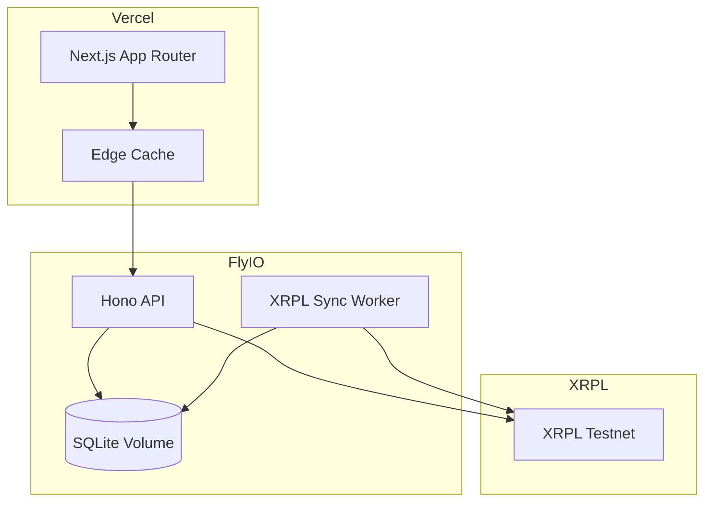

# MITATE System Architecture

## Overview
MITATE is a Next.js frontend on Vercel paired with a Hono API on Fly.io backed by SQLite. XRPL Testnet provides escrowed XRP, issued currency (YES/NO), DEX trading, multi-sign governance, and memo-based metadata. The backend is the source of truth for market state while continuously reconciling with on-chain data.

## Component Diagram
```mermaid
flowchart LR
  subgraph Client[Frontend - Next.js (Vercel)]
    UI[UI Pages + Components]
    Wallet[Wallet Connect (Xaman/GemWallet)]
    Realtime[Realtime Client (SSE/WebSocket)]
  end

  subgraph Backend[Backend - Hono API (Fly.io)]
    API[REST API]
    Worker[XRPL Sync Worker]
    Calc[Payout Calculator]
    DB[(SQLite on Fly Volume)]
  end

  subgraph XRPL[XRPL Testnet]
    Ledger[XRPL Ledger]
    WS[WebSocket Server]
    RPC[JSON-RPC / HTTP]
  end

  UI --> API
  Wallet --> XRPL
  Realtime --> API

  API --> DB
  Worker --> DB
  Calc --> DB

  API --> RPC
  Worker --> WS
  Worker --> RPC

  WS --> Worker
  RPC --> API
  Ledger --> WS
```

## Data Flow
1. Market creation
1. Frontend sends `POST /markets` with market metadata.
1. Backend writes a `markets` row with `status=Draft`.
1. Backend submits XRPL txs (AccountSet, SignerListSet if needed, EscrowCreate, memoed metadata).
1. Worker confirms ledger txs, updates market to `Open`, stores escrow sequence and tx hashes.

2. Betting
1. Frontend requests bet intent `POST /markets/:id/bets`.
1. Backend returns XRPL tx payload for user `Payment` and optional `TrustSet`.
1. User signs via wallet and submits to XRPL.
1. Worker sees `Payment` memo, creates `bets` row, creates escrow pool increment, and mints IOUs via issuer `Payment`.
1. Backend updates market totals and exposes live pool via realtime channel.

3. Secondary trading
1. User creates DEX `OfferCreate` using wallet.
1. Worker listens to `account_tx` for issuer/operator and `ledger` events, and records matched trades.
1. Frontend shows IOU price and order activity.

4. Resolution and payout
1. Admin resolves market via `POST /markets/:id/resolve`.
1. Backend creates multi-signed `EscrowFinish` (or `EscrowCancel`) and queues payout plan.
1. Once escrow finishes, backend executes payouts (batched `Payment`s).
1. Worker reconciles payouts, marks `payouts` as complete.

## Deployment Architecture


Operational notes
- Vercel hosts the Next.js frontend and static assets.
- Fly.io hosts the Hono API and XRPL sync worker in the same app or separate process groups.
- SQLite runs on a Fly volume with WAL mode enabled for concurrency.
- Environment variables provide XRPL endpoints, issuer/operator accounts, and signer settings.

## XRPL Integration Layer Design

### Backend Services
- `xrpl-client` module
  - Maintains HTTP JSON-RPC and WebSocket connections.
  - Normalizes tx results into internal events.
- `tx-builder` module
  - Builds XRPL transactions with memo encoding and validation.
  - Supports AccountSet, SignerListSet, TrustSet, Payment, EscrowCreate/Finish/Cancel, OfferCreate.
- `tx-signer` module
  - Supports multi-sign and single-sign flows.
  - Generates canonical tx blobs for wallet signing and server signing.
- `ledger-sync` module
  - Subscribes to `account_tx` for operator and issuer.
  - Subscribes to `ledger` close events.
  - Backfills on startup from last validated ledger index stored in DB.

### Event Types
- `MarketCreated`, `MarketOpened`
- `BetPaid`, `EscrowCreated`, `TokensMinted`
- `OfferCreated`, `OfferMatched`
- `MarketResolved`, `PayoutSent`, `MarketCanceled`

### Idempotency
- All XRPL events map to deterministic DB updates.
- Unique constraints on tx hash and offer sequence prevent double-apply.
- Ledger sync stores `last_ledger_index` in `system_state` for safe resume.

### Memo Encoding
- All txs include MemoType `MITATE` and MemoFormat `application/json`.
- MemoData JSON includes `v`, `type`, `marketId`, `outcome`, `amount`, and `timestamp`.

## Assumptions and Open Questions
- Pool escrow design uses a single pooled escrow per market; per-bet escrow is optional but not used by default.
- Payout requires token burn only if the demo chooses to enforce it; otherwise token burn is for accounting.
- Resolution uses 2-of-3 multi-sign as default and is adjustable via config.
