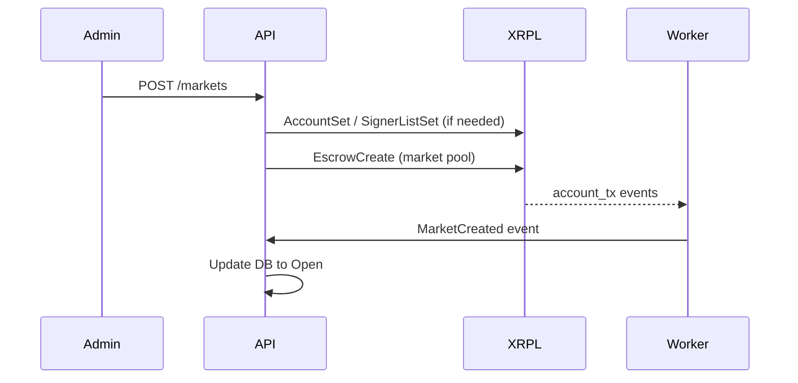
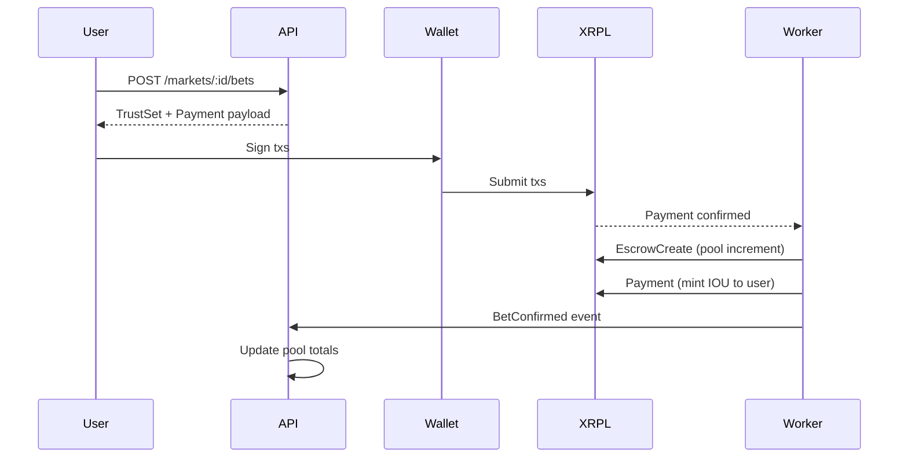
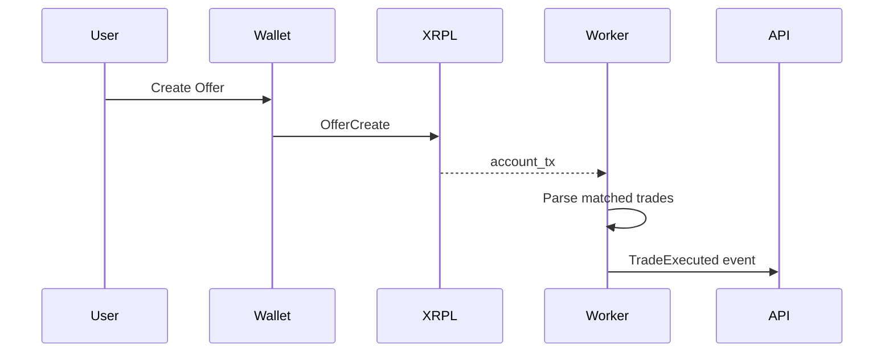
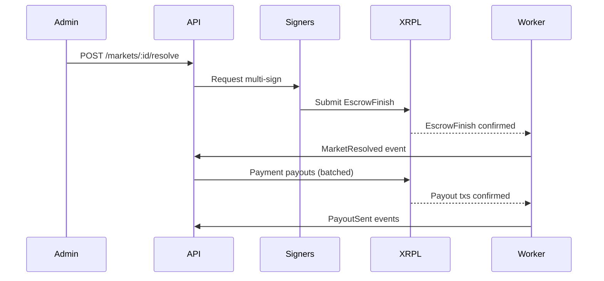
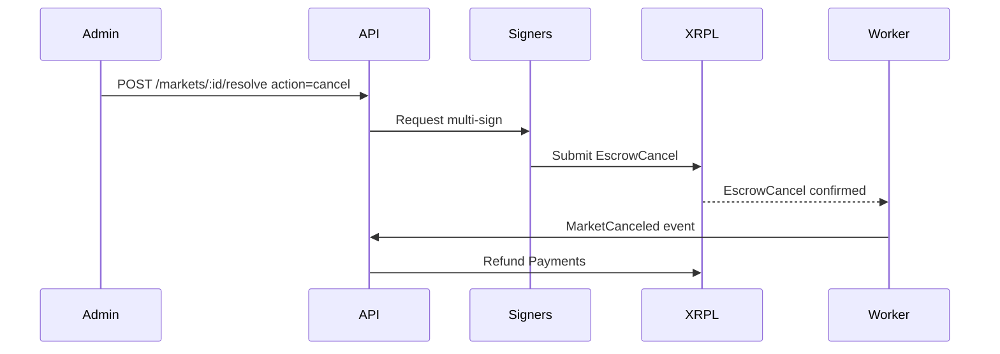

# XRPL Integration Design

## Overview
MITATE uses XRPL Testnet with Escrow, Issued Currency, Trust Lines, DEX Offers, Multi-Sign, and Memo metadata. All market-critical data can be independently verified on-ledger.

## Transaction Building Helpers
`tx-builder` module exposes typed helpers to build and validate XRPL transactions. All helpers attach Memo metadata and enforce Testnet-only settings.

Example helper signature
```ts
export function buildBetPayment(params: {
  account: string
  destination: string
  amountDrops: string
  marketId: string
  outcome: "YES" | "NO"
  memoTimestamp: string
}): Payment
```

Memo encoding
```ts
export function encodeMemo(data: Record<string, unknown>) {
  return {
    Memo: {
      MemoType: toHex("MITATE"),
      MemoFormat: toHex("application/json"),
      MemoData: toHex(JSON.stringify(data))
    }
  }
}
```

## WebSocket Subscription Strategy
- Subscribe to `account_tx` for operator and issuer accounts.
- Subscribe to `ledger` for deadline crossings and backfill triggers.
- On startup, fetch `account_tx` from last stored ledger index to current validated.
- Maintain a `last_ledger_index` in `system_state` to resume safely.

## Sequence Diagrams

### Market Creation


### Place Bet


### Secondary Trading


### Resolution and Payout


### Cancel Market


## Error Recovery and Retry Logic

### Submission failures
- On `tem` or `tel` errors, retry with exponential backoff up to 3 times.
- On `tef` or `tec` errors, mark tx as failed and open an admin alert.

### Escrow create or mint failure
- If `Payment` from user succeeds but mint fails, create a `bets` row with `status=Failed` and queue refund.
- If escrow create fails, do not mint tokens. Queue refund.

### WebSocket disconnect
- Reconnect with backoff.
- On reconnect, backfill from `last_ledger_index` to avoid missing events.

### Idempotent writes
- Store `tx_hash` and `ledger_index` in `ledger_events`.
- Use `INSERT OR IGNORE` for duplicate events.

## XRP and IOU Helpers
- `amountDrops` uses string integer drops.
- IOU amounts use string decimal.
- Convert XRP <-> drops using fixed 1 XRP = 1,000,000 drops.

## Payout Calculation
- `payout = totalPool * userBet / totalWinningBets`.
- Compute in integer drops with floor rounding.
- Store rounding remainder in a `market_remainder_drops` field and distribute to largest bettors if needed.

